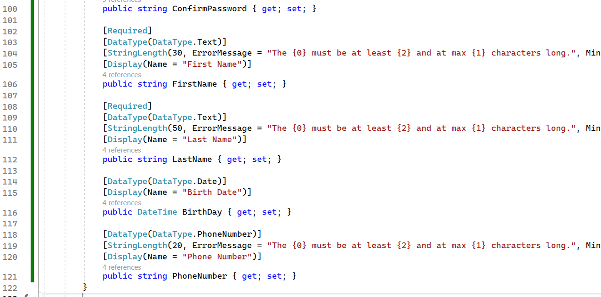

# Customizing the Identity User

In this first walkthrough, the default Identity User is overridden and the registration view is updated to allow registration of a new user with additional fields.

## Part 1: Customizing ASP.NET Identity 

In this first part, the ASP.NET Identity is leveraged to create a new custom user object.  The new user object is then used to override the default Identity User object.  

### Step 1: Open the starter project and get it working

To get started, you need to have the project working

1. Open the project
1. Run the migrations

    In the package manager console, run the following commands:

    ```powershell
    update-database
    ```  

      
    
1. Run the project
1. Register a user (accept email confirmation on the page)

    Use the `Register` button and fill out the fields:

      

1. Log in as the user
1. Validate that user is logged in and email is shown at the top of the screen

      

1. Review the register user page again and note the fields that are available versus fields you might want to add.

    The current fields are:
    - Email
    - Password
    - Confirm Password

    What additional fields would you want to add?

    Potential new fields:
    - First Name
    - Last Name
    - Phone Number
    - Address
    - ...

### Step 2: Create a custom user class which tracks the user's first and last name, as well as an optional phone number and date-of-birth.

1. Create a new class called `CustomizingIdentityUser` in the `Models` folder

    ```csharp
    //Information: https://learn.microsoft.com/aspnet/mvc/overview/getting-started/getting-started-with-ef-using-mvc/creating-a-more-complex-data-model-for-an-asp-net-mvc-application#the-datatype-attribute
    public class CustomizingIdentityUser : IdentityUser
    {
        [StringLength(30)]
        public string FirstName { get; set; }
        [StringLength(50)]
        public string LastName { get; set; }

        [PersonalData]
        [StringLength(20)]
        public string PhoneNumber { get; set;}
        
        [PersonalData]
        [DataType(DataType.Date)]
        [DisplayFormat(DataFormatString = "{0:dd/MM/yyyy}", ApplyFormatInEditMode = true)]
        public DateTime? Birthday { get; set; }
    }
    ```

1. Utilize the new user object in the project

    In order to use the new user object, you need to update the `AddDefaultIdentity` section of the `Program.cs` file to reference the `CustomizingIdentityUser` class instead of the `IdentityUser` class.

    In `Program.cs` the original line:

    ```csharp
    builder.Services.AddDefaultIdentity<IdentityUser>(options => options.SignIn.RequireConfirmedAccount = true)
                .AddEntityFrameworkStores<ApplicationDbContext>();
    ```

    

    Becomes:

    ```csharp
    builder.Services.AddDefaultIdentity<CustomizingIdentityUser>(options => options.SignIn.RequireConfirmedAccount = true)
                .AddRoles<IdentityRole>()
                .AddDefaultUI()
                .AddDefaultTokenProviders()
                .AddEntityFrameworkStores<ApplicationDbContext>();
            builder.Services.AddControllersWithViews();
    ```   

    

1. Update the `ApplicationDbContext` to use the new user object

    Once you have the new user type injected in the `Program.cs` file, you need to update the `ApplicationDbContext` to use the new user type.

    ```csharp
    public class ApplicationDbContext : IdentityDbContext
    {
        public ApplicationDbContext(DbContextOptions<ApplicationDbContext> options)
            : base(options)
        {
        }
    }
    ```

    becomes:

    ```csharp
    public class ApplicationDbContext : IdentityDbContext<CustomizingIdentityUser>
    {
        public ApplicationDbContext(DbContextOptions<ApplicationDbContext> options)
            : base(options)
        {
        }
    }
    ```

    >**Note:** this will also require the using statement to be added to the top of the file for the Models reference.

    ```csharp
    using CustomizingIdentityMVCWeb.Models;
    ```

1. Create a migration to update the user object

    Currently the new fields are not in place for the new user.

    In the package manager console, run the following command:

    ```powershell
    add-migration AddCustomUserFields
    ```  

      

    >**Note:** You will see a warning for loss of data.  This is expected.

    Review the migration and make sure all the fields are present in the `Up` method.

1. Update the database and review it

    Use the PMC to run the command:

    ```powershell  
    update-database
    ```  

    Then open the database in SQL Server Object Explorer or SSMS (SQL Server Management Studio) and review the ASPNetUsers table to see the new fields.

    

1. Run the project and see an error (on purpose)

    I like to purposefully create common errors. There is one thing that is still broken but it's not intuitive and the error message isn't helpful.

      

    The error says 
    
    ```text
    An unhandled exception occurred while processing the request. 
    
    InvalidOperationException: No service for type 'Microsoft.AspNetCore.Identity.UserManager`1[Microsoft.AspNetCore.Identity.IdentityUser]' has been registered.
    ```

    But you already put that into the startup code of `Program.cs`.  What's going on?

1. Fix the error

    The error is because there are still references to the `IdentityUser` object in your project.  Do a `ctrl + shift + f` to find `IdentityUser`.  
    
    

    You can ignore any that are obviously the `CustomizingIdentityUser` object and you can ignore anything in the migrations.

      

    Update the two references to `IdentityUser` to be `CustomizingIdentityUser`, then run the project.

      
     

1. Review the registration page

    The project runs but nothing is changed.

    Why didn't the new fields get picked up? The reason is because there are a bunch of views related to the user that you currently have no access to.  If you look into the Identity folder, you'll see that you don't have access to the views that need to be updated.

     

## Part 3: Scaffolding the Identity Views

To complete the work on overriding the user, the next step is to scaffold the identity views so you can customize them.

To Scaffold the views, utilize the built-in tools from Visual Studio.

1. Right-click on the project and select `Add` > `New Scaffolded Item...`

    

1. When the dialog comes up, select `Identity`, then choose the `Identity` option and select `Add`

      

1. In the next dialog, choose all of the pages you would like to modify.

    You can select them all or just the ones you care about.  You can always come back and add more later.  For this demo, just select them all.

    Select the `ApplicationDbContext` as the data context class (if you are doing this on your own, select the context that contains your Identity user object).

      

1. Review the new Identity views

    Under the `Identity -> Pages -> Account`, all of the files to override are now available for you to customize.  The `Manage` folder has additional views that can be overridden as well.

      

1. Open the `Register.cshtml` page and add the additional fields.

    Modify the `Register.cshtml` page to add the additional fields.

    Add the following html to the page after the confirm password html and before the register button.

    ```html
    <div class="form-floating mb-3">
        <input asp-for="Input.FirstName" class="form-control" aria-required="true" placeholder="First Name" />
        <label asp-for="Input.FirstName">First Name</label>
        <span asp-validation-for="Input.FirstName" class="text-danger"></span>
    </div>

    <div class="form-floating mb-3">
        <input asp-for="Input.LastName" class="form-control" aria-required="true" placeholder="Last Name" />
        <label asp-for="Input.LastName">Last Name</label>
        <span asp-validation-for="Input.LastName" class="text-danger"></span>
    </div>

    <div class="form-floating mb-3">
        <input asp-for="Input.PhoneNumber" class="form-control" aria-required="true" />
        <label asp-for="Input.PhoneNumber">Phone Number</label>
        <span asp-validation-for="Input.PhoneNumber" class="text-danger"></span>
    </div>

    <div class="form-floating mb-3">
        <input asp-for="Input.BirthDay" class="form-control" aria-required="true" />
        <label asp-for="Input.BirthDay">Birth Day</label>
        <span asp-validation-for="Input.BirthDay" class="text-danger"></span>
    </div>

    ```

      

    >**Note:** The fields are not defined on the ViewModel so there will be errors that will be fixed in the next step.

1. Modify the `Register` viewmodel that backs the page to include the missing fields.

    Open the RegisterViewModel class and add the missing fields to the declaration in the `InputModel` class:

    ```csharp
    [Required]
    [DataType(DataType.Text)]
    [StringLength(30, ErrorMessage = "The {0} must be at least {2} and at max {1} characters long.", MinimumLength = 1)]
    public string FirstName { get; set; }

    [Required]
    [DataType(DataType.Text)]
    [StringLength(50, ErrorMessage = "The {0} must be at least {2} and at max {1} characters long.", MinimumLength = 1)]
    public string LastName { get; set; }

    [DataType(DataType.Date)]
    [Display(Name = "Birth Date")]
    public DateTime? BirthDay { get; set; }

    [DataType(DataType.PhoneNumber)]
    [StringLength(20, ErrorMessage = "The {0} must be at least {2} and at max {1} characters long.", MinimumLength = 9)]
    public string PhoneNumber { get; set; }
    ```

    Place the code right after the field for `public string ConfirmPassword { get; set; }`

      

    Save and build to make sure the project has no errors.

1. Modify the save method to handle the new parameters

    The register view model needs to be mapped to the user that is created for insert.

    Find the line of code for the method `OnPostAsync` on the RegisterModel:
    
    ```csharp
    public async Task<IActionResult> OnPostAsync(string returnUrl = null)
    ```  

    In the method, change the code after the line:

    ```csharp
    await _emailStore.SetEmailAsync(user, Input.Email, CancellationToken.None);
    ```  

      

    To include the mapping of the new fields:

    ```csharp
    //map the additional fields
    user.FirstName = Input.FirstName;
    user.LastName = Input.LastName;
    user.Birthday = Input.BirthDay;
    user.PhoneNumber = Input.PhoneNumber;
    ```  

      

1. Run the project and register a new user  

    The view will now show the fields for the user.  Note that the `Display(Name=...)` attribute is used to change the label for the field.

    

    Accept the email confirmation and log in as the user.

      

## Conclusion

In this first walkthrough, a new user object was created to have additional fields and the default Identity User was overridden to use the new user object.  The new user object was then used to override the default registration page to include the new fields and the new fields were mapped to the user object when the user was created.  

While there is much more work to do to finish the work of using the custom user (such as displaying additional fields on the user profile page), this is a good start to show how to override the default Identity User and add additional fields to the registration page.