# Utilize Third-Party Sign-Ins

In this second walkthrough, the project is modified to use third-party sign-ins.  Specifically, the project is modified to use Microsoft sign-ins.  

Additional providers could be registered from `Facebook`, `Google`, and others following a similar process of creating an application as a developer on the specific platform and implementing the provider in the application.

## Part 1: Deploy to Azure

If you haven't already, now would be a great time to set up CI/CD and or right-click and publish to Azure

1. Get your application working at Azure
1. Ensure migrations on the database are applied
1. Ensure you can log in
1. Ensure you can register a user in the ASP.NET Identity from your website

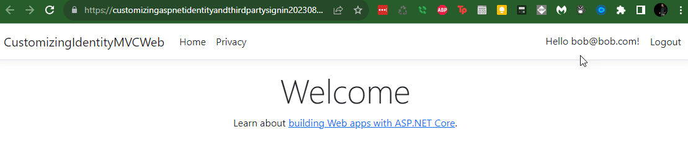  

## Part 2: Add Authentication to your Web application

In order to utilize Microsoft as a sign-in provider, an app registration is needed in your Azure AD tenant.

The tenant users will still be able to log in with accounts not directly associated to their tenant account (i.e. `bob@bob.com`), but this will NOT associate the tenant user into the app directly (that will happen in the next step).

1. Navigate to the [Azure Portal](https://portal.azure.com) and login with your Azure AD credentials.
1. Navigate to your App Service and select `Authentication / Authorization` from the left menu.
1. Select `Add Identity Provider`

    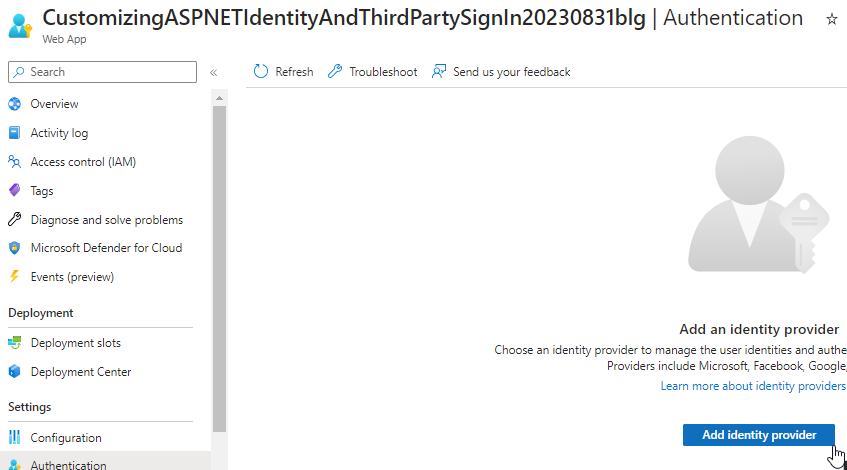  

1. Select `Microsoft`

    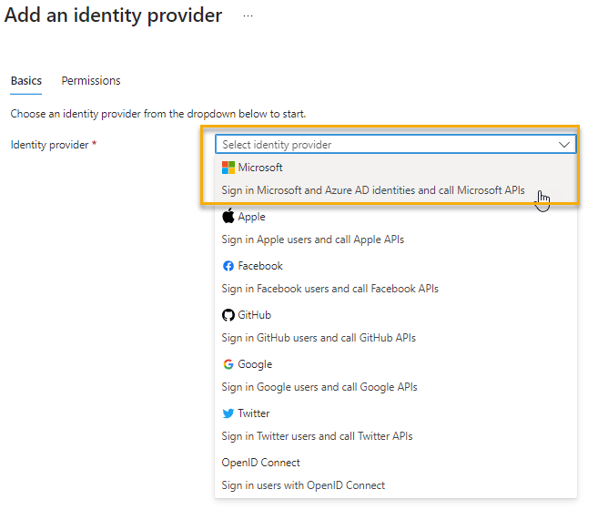

1. Select the appropriate Tenant Type

    The current options are:
    - Workforce: For your org and personal accounts (We will use this one).
    - Customer (Preview): For customer accounts (social and local). This is in preview at the time of this writing.

    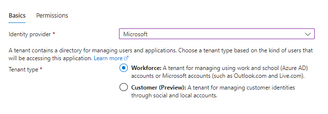  

1. Create a new App Registration to manage the Authentication

    IF you already created a new app registration you can use that, otherwise just choose `Create New App Registration`.  

    Leave the name as is or change it if you desire.

    Choose the appropriate supported account types.  If you are on a personal subscription, you'll need to use the `Any Azure AD directory & personal Microsoft accounts` option.

    If you are doing this for work, use the `Current Tenant` to lock it down to just your org users.

    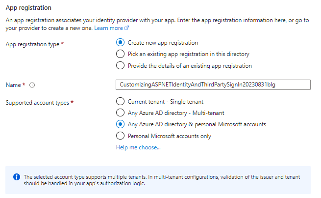  

1. Restrict access

    You can restrict access to your application so that it is no longer available to the public without authentication (Note: This is not Authorization, but just acts as a gate to view the application or get a 403 error when browsing to the site).

    Select `Require Authentication`  (default)

    For unauthenticated requests, present a sign-in option by selecting `HTTP 302 Found Redirect` (default)  

    Leave the `Token store` option checked (default)

    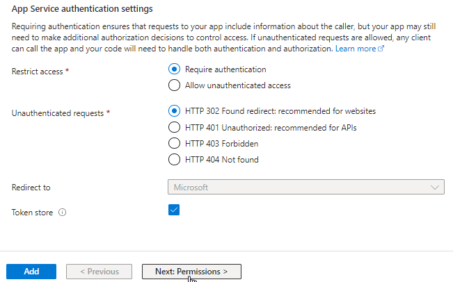  

1. Review Permissions

    You MUST enable User.Read, which is there by default.  If you try to add or change permissions, the User.Read will be lost so make sure you re-select it if you add additional permissions.

    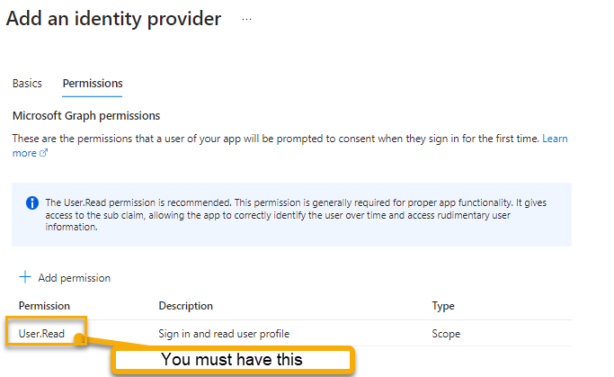  

    Hit `Add` to create the provider.  

    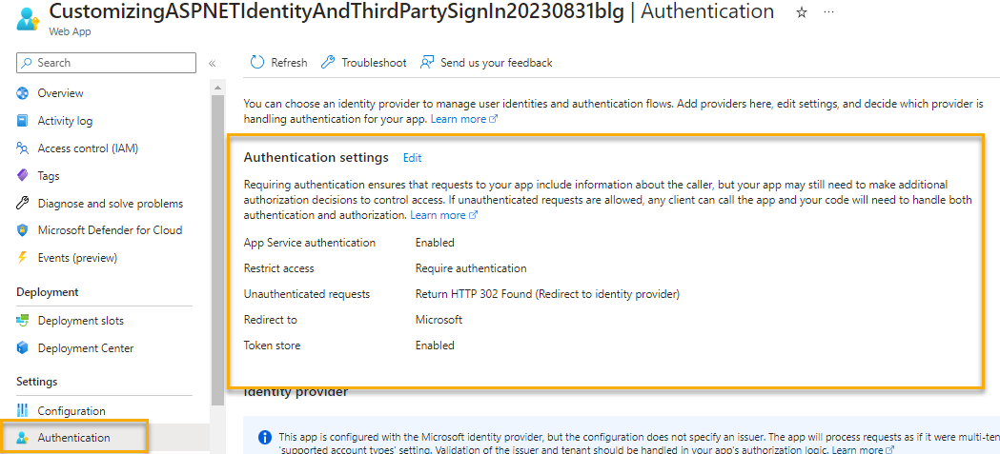  

1. Browse to the website and sign in.

    On your next visit, you will get redirected as per the authentication settings.

    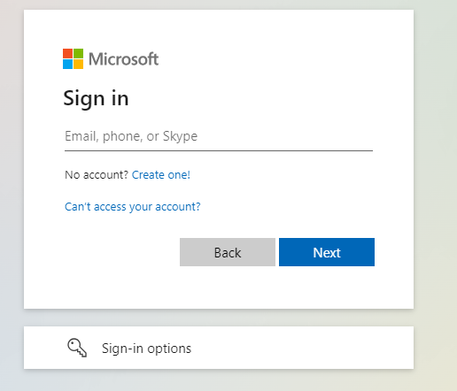  

    Once you are signed in, you will have to authorize the app for your account:

    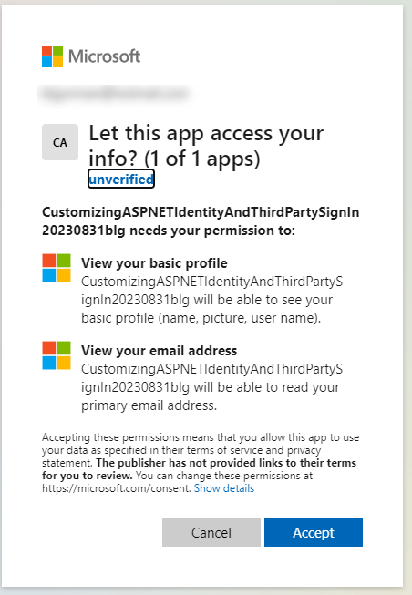  

    >**Note:** If you cancel, you won't get in and you'll get asked again on the next attempt.

    Once you accept, you will get to the app as before, and you can log in with an ASP.NET Identity account or register a new user.  

## Part 3: Add the Microsoft Identity Platform to your Web application

To be able to get a single-sign-on experience, you need to add the Microsoft Identity Platform to your application.

1. Get the NuGet package

    - Microsoft.AspNetCore.Authentication.MicrosoftAccount


1. Open the `Program.cs` file
1. Add the following code to `Program.cs` utilize Microsoft as a sign-in provider:

```csharp
builder.Services.AddAuthentication().AddMicrosoftAccount(microsoftOptions =>
{
    microsoftOptions.ClientId = builder.Configuration["Authentication_Microsoft_ClientId"];
    microsoftOptions.ClientSecret = builder.Configuration["Authentication_Microsoft_ClientSecret"];
});
```  

## Part 4: Create the App Registration for the sign in provider

1. Create a second app registration in the Azure Portal

    Navigate to the Azure portal and select `App Registrations`.

    Although your authentication created an app registration earlier, this one will be different enough that it will be better to just use a second app registration.

    Create a new App Registration and give it a name.

    ```text
    CustomizingASPNETIdentityAndThirdPartySignInProvider
    ```  

    Select the correct account type for your scenario.

    Add a Web redirect uri as follows using the port where your local application runs (mine is 7245, yours may be different - you can see it in the browser when you run the application):

    ```text
    https://localhost:7245/signin-microsoft
    ```

    Hit the `Register` button.

    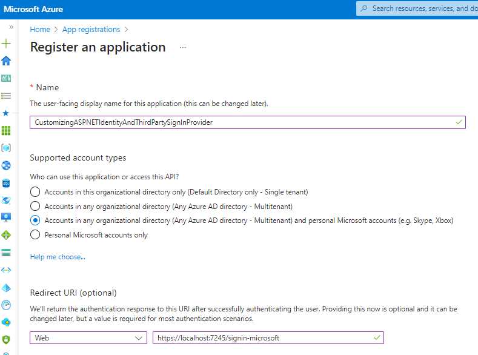  

1. Add the additional redirect(s) for your App Service

    Use the App Service public-facing URL and create another redirect uri as follows:

    ```text
    https://<yourappservice>.azurewebsites.net/signin-microsoft
    ```   

    >**Note**: If you have any slots, you will also need to add their URIs here as well

    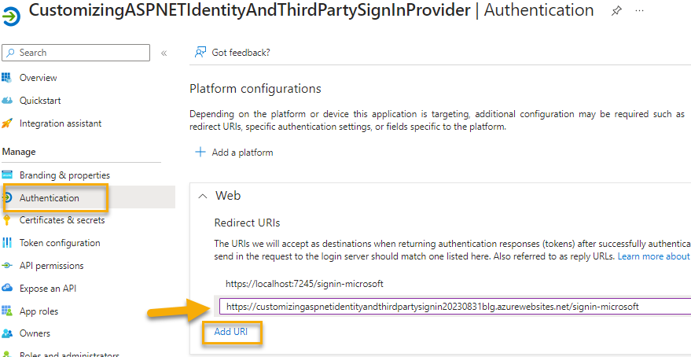  

    Make sure to `Save` the changes by hitting the `Save` button at the bottom left of the page.

1. Create an Application Secret

    On the app registration page, select `Certificates & secrets` from the left menu.

    Add a new client secret, give it a description, and select an expiration.  Add the secret, then immediately copy the Secret VALUE and save it somewhere safe.  You will not be able to retrieve it again.  

    >**Note**: The Secret ID is not used for anything

    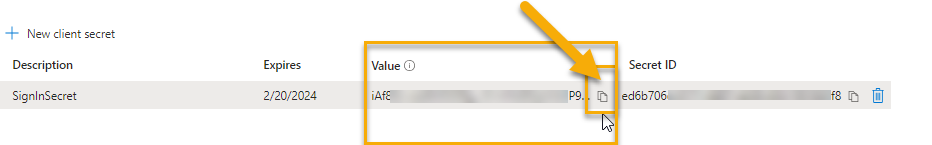  

1. Navigate to the `Overview` and get the ApplicationID

    Get the Application Id.  In combination with the secret value, this will allow the authorization to work from the application code:

    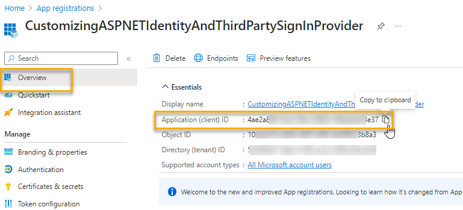  

1. Add the ApplicationID and Secret to the configurations

    Add the values as named in code to your local secrets file and to the Azure App Service configuration.

    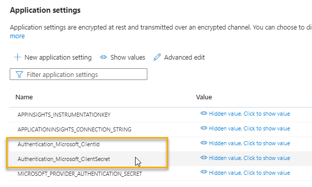  

    Save the changes.

1. Run the application and navigate to register a user

    You will now see the `Microsoft` option in the list of providers:

    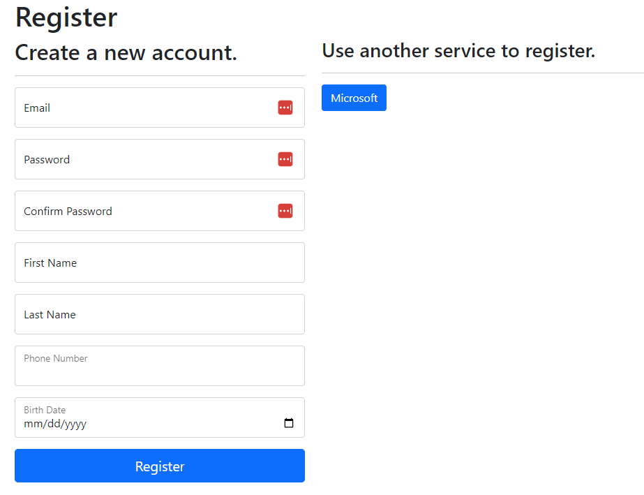  

    Allow the application.

    The app will `successfully authenticate with Microsoft` and you'll be asked to register any email:

    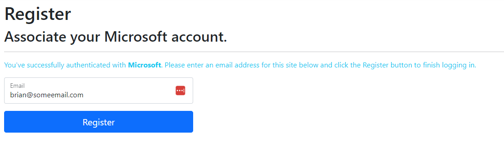  

    Note that the registration will fail because of the required properties added to the user earlier.

## Part 5 fix the registration for third-party sign-ins

Note that if you didn't override the default user, this page would have worked and you wouldn't need to add additional properties to the user.

However, this is a different view and you need to add the fields to the backing model and the view cshtml file.

1. Navigate to the `ExternalLogin.cshtml` file

    Add the following fields to the html:

    ```html
    <div class="form-floating mb-3">
        <input asp-for="Input.FirstName" class="form-control" aria-required="true" placeholder="First Name" />
        <label asp-for="Input.FirstName"></label>
        <span asp-validation-for="Input.FirstName" class="text-danger"></span>
    </div>

    <div class="form-floating mb-3">
        <input asp-for="Input.LastName" class="form-control" aria-required="true" placeholder="Last Name" />
        <label asp-for="Input.LastName"></label>
        <span asp-validation-for="Input.LastName" class="text-danger"></span>
    </div>

    <div class="form-floating mb-3">
        <input asp-for="Input.PhoneNumber" class="form-control" aria-required="true" />
        <label asp-for="Input.PhoneNumber"></label>
        <span asp-validation-for="Input.PhoneNumber" class="text-danger"></span>
    </div>

    <div class="form-floating mb-3">
        <input asp-for="Input.BirthDay" class="form-control" aria-required="true" />
        <label asp-for="Input.BirthDay"></label>
        <span asp-validation-for="Input.BirthDay" class="text-danger"></span>
    </div>
    ```  

    Add these fields after the `Email` field and before the `Register` button.

    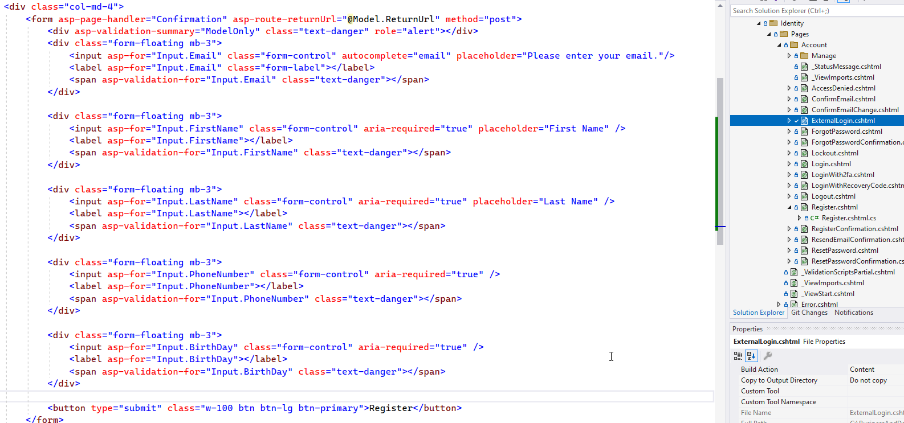  

1. Update the backing model for the page

    The backing model is the `InputModel` class in the `ExternalLogin.cshtml.cs` file.

    ```csharp
    [Required]
    [DataType(DataType.Text)]
    [StringLength(30, ErrorMessage = "The {0} must be at least {2} and at max {1} characters long.", MinimumLength = 1)]
    [Display(Name = "First Name")]
    public string FirstName { get; set; }

    [Required]
    [DataType(DataType.Text)]
    [StringLength(50, ErrorMessage = "The {0} must be at least {2} and at max {1} characters long.", MinimumLength = 1)]
    [Display(Name = "Last Name")]
    public string LastName { get; set; }

    [DataType(DataType.Date)]
    [Display(Name = "Birth Date")]
    public DateTime BirthDay { get; set; }

    [DataType(DataType.PhoneNumber)]
    [StringLength(20, ErrorMessage = "The {0} must be at least {2} and at max {1} characters long.", MinimumLength = 9)]
    [Display(Name = "Phone Number")] 
    public string PhoneNumber { get; set; }
    ```

      

1. Map the additional user fields

    Find the line `await _emailStore.SetEmailAsync(user, Input.Email, CancellationToken.None);`

    and add the following lines before the line `var result = await _userManager.CreateAsync(user);`:

    ```csharp
    //map the additional fields
    user.FirstName = Input.FirstName;
    user.LastName = Input.LastName;
    user.Birthday = Input.BirthDay;
    user.PhoneNumber = Input.PhoneNumber;
    ```

      

1. Publish and re-register the user

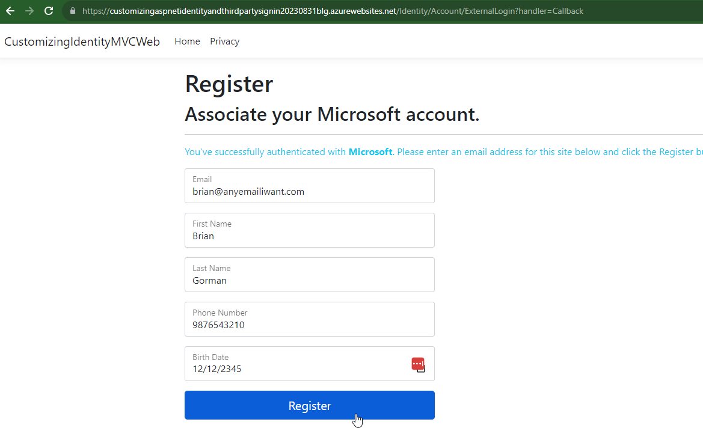.  

1. Log in with the user

    You will now see the Microsoft button for log in as well:

    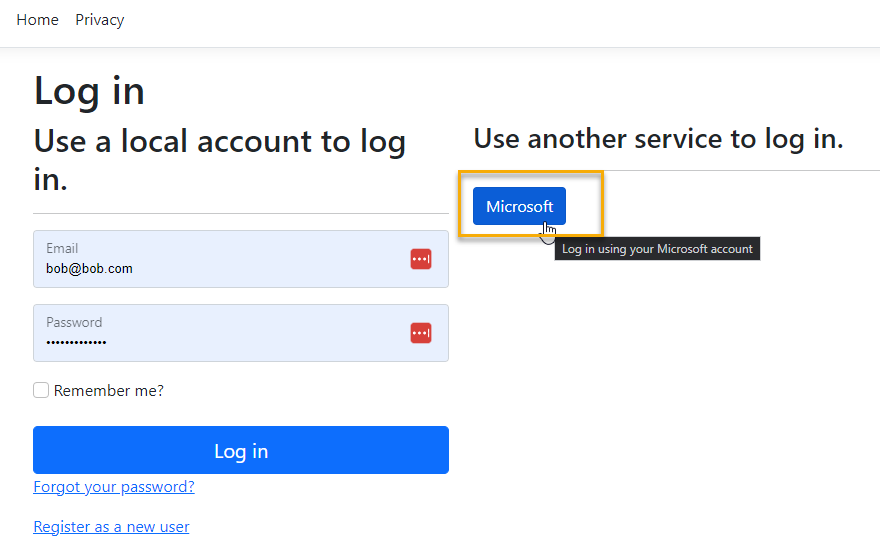  

1. Review your user is logged in as expected

    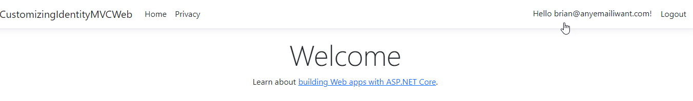  


    >**Note:** you don't have to enter a password now that you've utilized the third party sign-in.

1. The user is registered and can be added to roles for authorization in the application.

    Reviewing the database validates that the user is part of the ASP.NET Identity tables:

    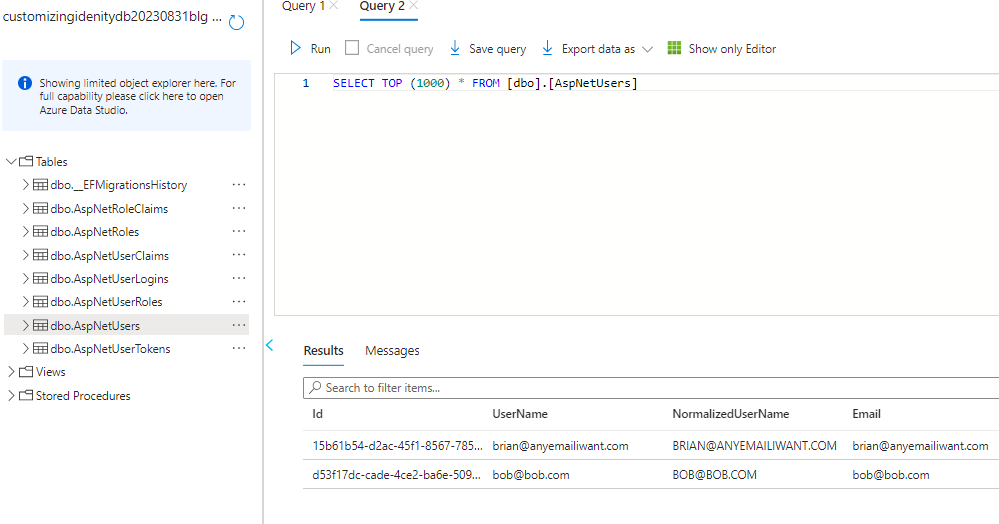  

## Conclusion

In this walkthrough you learned how to work with the Microsoft Identity object for authentication to log a user in via their Microsoft account.  You then saw how to utilize the authorization of the MVC application to validate the Microsoft identity when registering and logging in a user.

